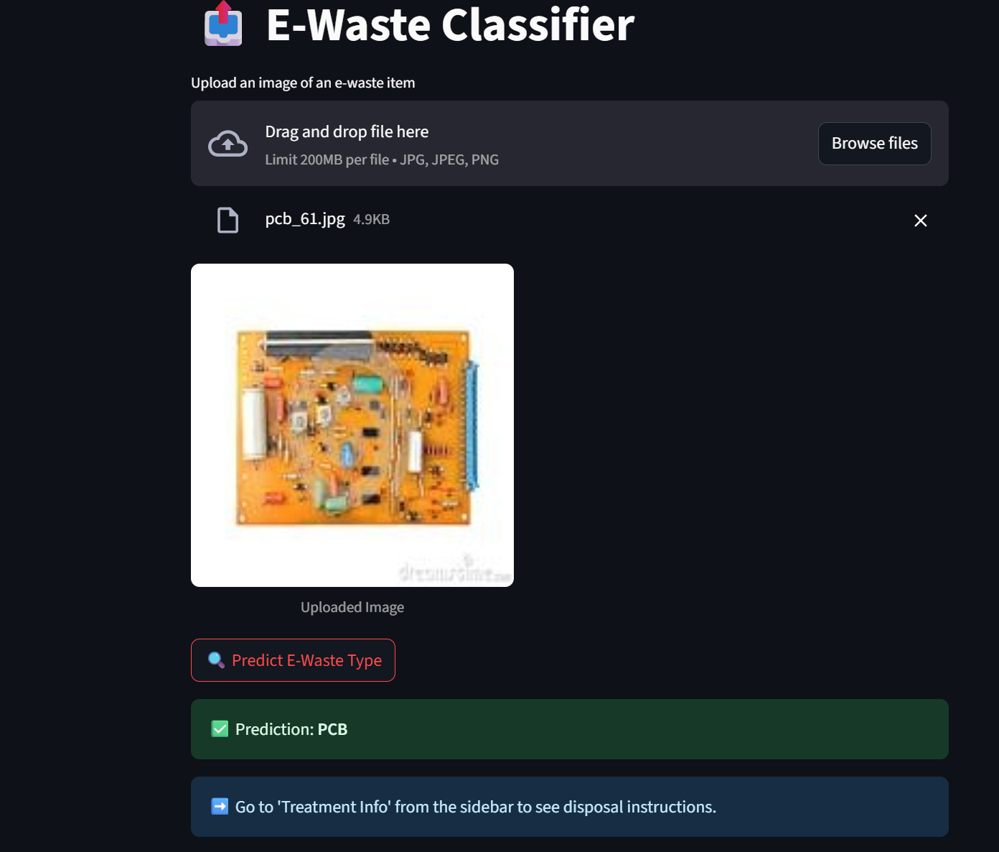

## ♻️ E-Waste Classifier
This project uses Deep Learning (EfficientNetV2B2 or ResNet50) to classify e-waste images into categories like Mobile Phone, Laptop, Battery, Printer, etc., and provides appropriate treatment/disposal suggestions.

## 🔍 Features
- 📤 Upload and classify e-waste images
- 🔘 "Predict" button for manual control
- 🧠 High-accuracy classification using EfficientNetV2B2 / ResNet50
- 📝 Real-time prediction via a clean Streamlit UI
- ♻️ Displays treatment instructions per item (from info.json)
- 🖼️ Smaller, cleaner image display in results
- 📄 Two-page UI: Upload & Predict and Treatment Info

## 🛠️ Tech Stack
- Python
- TensorFlow / Keras
- EfficientNetV2B2 or ResNet50
- Streamlit
- PIL, NumPy
- JSON (for treatment info)

## 📷 output Screenshot



## 🚀 How to Run

```bash
# Step 1: Install dependencies
pip install -r requirements.txt

# Step 2: Run the Streamlit app
streamlit run app.py